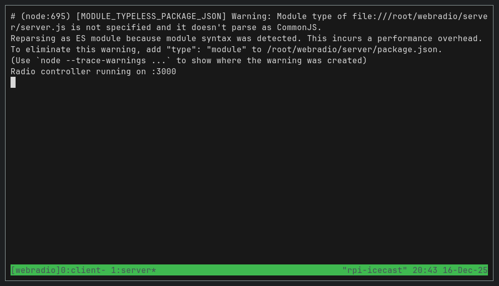
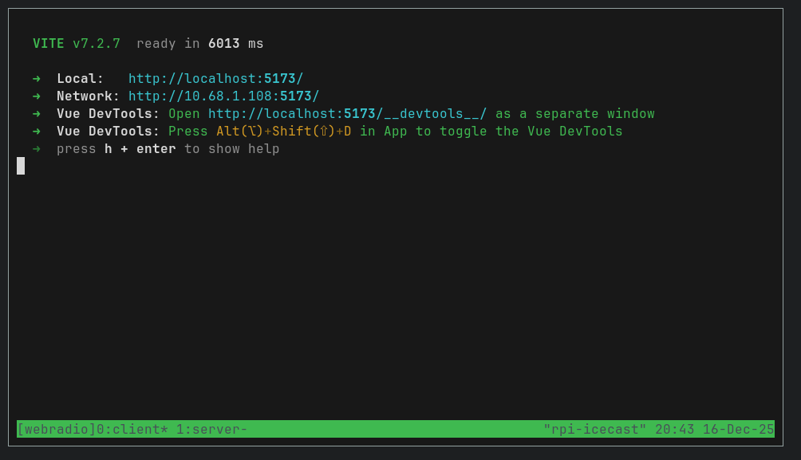
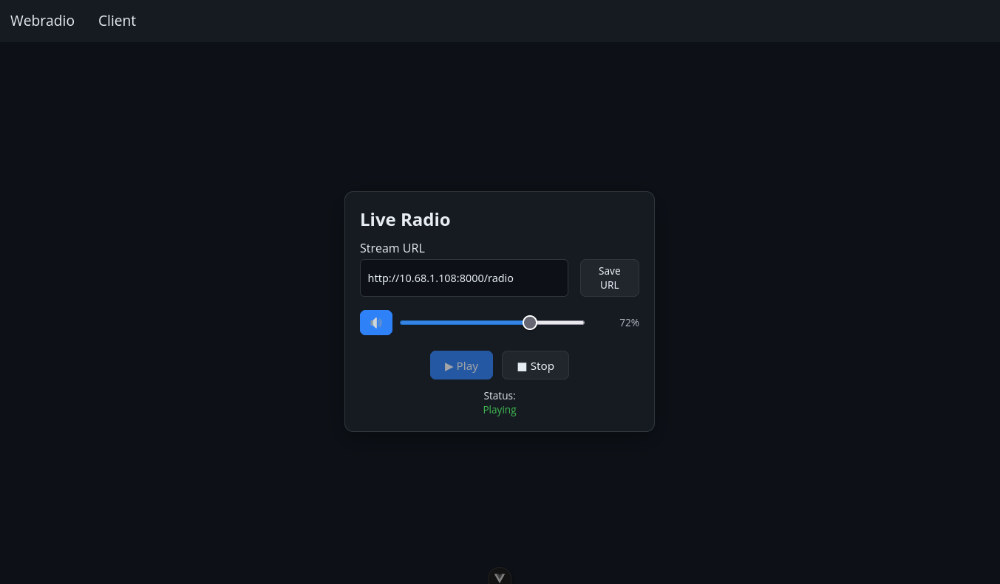
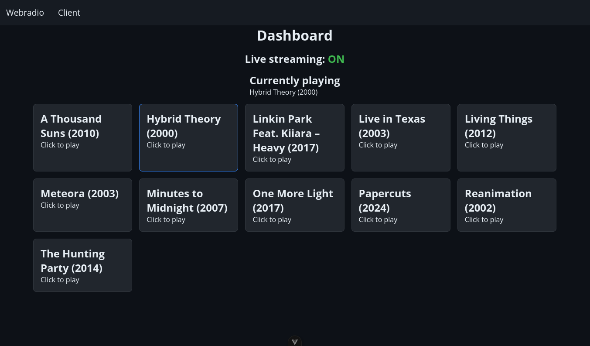

# Webradio
## Návrh a realizace multimediálního systému

## 1. Úvod a význam systému

Cílem tohoto projektu je návrh a realizace jednoduchého, ale plně funkčního **multimediálního systému pro internetové rádio (webradio)**. Systém umožňuje centrální přehrávání hudby ze serveru a její distribuci posluchačům prostřednictvím streamu dostupného v běžném webovém prohlížeči nebo v přehrávačích jako je mpv či VLC.

Význam systému spočívá zejména v:

* demonstraci principů multimediálních systémů (zpracování zvuku, streaming, klient–server architektura),
* praktickém propojení hardwarové a softwarové části,
* využití open‑source technologií,
* možnosti dalšího rozšiřování (živé vysílání, metadata skladeb, autentizace, mobilní klient apod.).

Systém je navržen jako **nízkonákladové řešení**, vhodné např. pro školní projekty, komunitní rádio nebo experimentální multimediální aplikace.

---

## 2. Funkční popis systému

### 2.1 K čemu systém slouží

Webradio systém slouží k:

* výběru aktivního playlistu přes webové rozhraní,
* přehrávání streamu v reálném čase přes webový klient.

Uživatel (administrátor) může pomocí webového rozhraní:

* zobrazit dostupné playlisty,
* spustit vybraný playlist,
* přepínat mezi playlisty

Posluchač může:

* otevřít webový přehrávač,
* nastavit URL streamu,
* ovládat hlasitost přehrávání.

---

### 2.2 Základní scénář použití

1. Server je spuštěn na zařízení Raspberry Pi.
2. Node.js API načte dostupné playlisty ze souborového systému.
3. Po výběru playlistu je pomocí nástroje ffmpeg zahájen streaming do Icecast serveru.
4. Icecast distribuuje audio stream posluchačům.
5. Webový klient (Vue.js) přehrává stream pomocí HTML5 `<audio>` prvku.

---

## 3. Technické řešení systému

### 3.1 Architektura

Systém je rozdělen do tří hlavních částí:

1. **Streaming server** – Icecast
2. **Řídicí aplikační vrstva** – Node.js
3. **Klientská aplikace** – Vue.js (webový prohlížeč)

```
[ Playlisty (MP3, WAV, FLAC) ]
          ↓
     Node.js API
          ↓ (ffmpeg)
      Icecast server
          ↓
   Webový klient / mpv
```

---

### 3.2 Hardwarové komponenty

| Komponenta       | Popis                                       |
| ---------------- | ------------------------------------------- |
| Raspberry Pi 3B+ | Centrální server pro Icecast a Node.js      |
| microSD          | Úložiště operačního systému a hudebních dat |
| Síťové připojení | Ethernet / Wi‑Fi                            |

Raspberry Pi bylo zvoleno díky:

* nízké ceně,
* nízké spotřebě energie,
* dostatečnému výkonu pro audio streaming.

---

### 3.3 Softwarové komponenty

#### Operační systém

* Linux (např. Void Linux / Debian / Alpine Linux)

#### Icecast

* Open‑source streaming server
* Zajišťuje distribuci audio streamu posluchačům

#### Node.js

* Slouží jako aplikační logika systému
* Poskytuje REST API:

  * `/api/playlists` – seznam playlistů
  * `/api/play` – spuštění playlistu

#### ffmpeg

* Zpracování audio souborů
* Převod playlistů do streamu
* Odesílání dat do Icecast serveru

#### Vue.js (Vite)

* Webový klient
* Umožňuje:

  * výběr playlistu,
  * přehrávání streamu,
  * ovládání hlasitosti,
  * konfiguraci URL streamu.

---

### 3.4 Vstupní a výstupní formáty

**Vstupy:**

* audio soubory (playlisty),
* HTTP požadavky z webového klienta.

**Výstupy:**

* MP3 audio stream (256 kb/s),
* webové rozhraní (HTML, CSS, JavaScript).

---

### 3.5 Síťová komunikace

* HTTP REST API (Node.js)
* HTTP audio streaming (Icecast)
* WebSockety nejsou v základní verzi použity

---

## 4. Kalkulace systému

### 4.1 Hardwarové náklady

| Položka          | Cena (Kč)     |
| ---------------- | ------------- |
| Raspberry Pi 4   | ~1 200        |
| microSD / SSD    | ~300          |
| Napájecí adaptér | ~200          |
| **Celkem**       | **~1 700 Kč** |

### 4.2 Softwarové náklady

Veškerý použitý software je:

* open‑source,
* zdarma,
* bez licenčních poplatků.

Celkové softwarové náklady: **0 Kč**.

---

## 5. Dokumentace realizace

### 5.1 Spuštění systému

Projekt je verzován pomocí Git a je dostupný na:
[https://github.com/filiprojek/webradio]()


Automatizované nasazení je možné pomocí Ansible playbooku, který:

* naklonuje repozitář,
* nainstaluje závislosti,
* vytvoří spouštěcí skripty,
* spustí klientskou i serverovou část v tmux session.

---

### 5.2 Obrazová dokumentace

Obrazová dokumentace zahrnuje:

* screenshot webového klienta,
* běžící tmux session (server + klient),
* ukázku přehrávání streamu.

#### Server – Node.js API


#### Server – Vue.js klient (vývojové prostředí)


#### Webový klient – přehrávač


#### Webové rozhraní – Dashboard


---

*Autor projektu: Filip Rojek*
